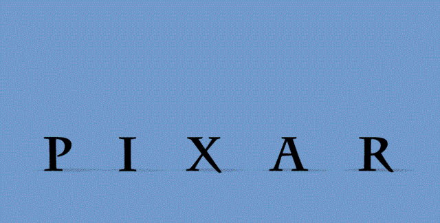
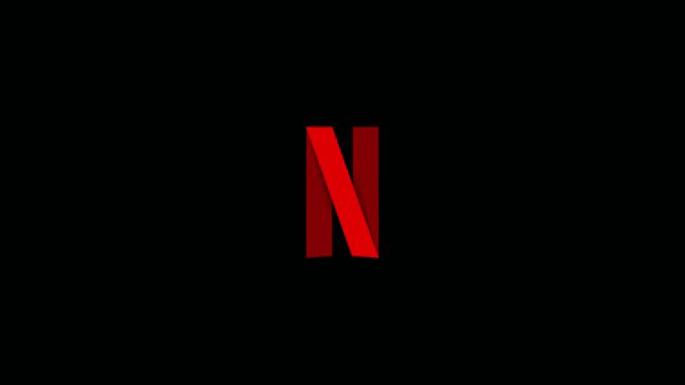

# Three.js-Production-Logo
A simple production logo animation I created using Three.js

### Getting Started

The three.js library is already loaded on HTML. Just run the application using Live Server.

### What is a production logo?
In TV and cinema, it is common for studios and production companies to create visual identities through short films. Known as production logos, they typically feature the company's logo with some characteristic movement or character. In Figure 1, we see four of these classic visual identities from cinema.

 

